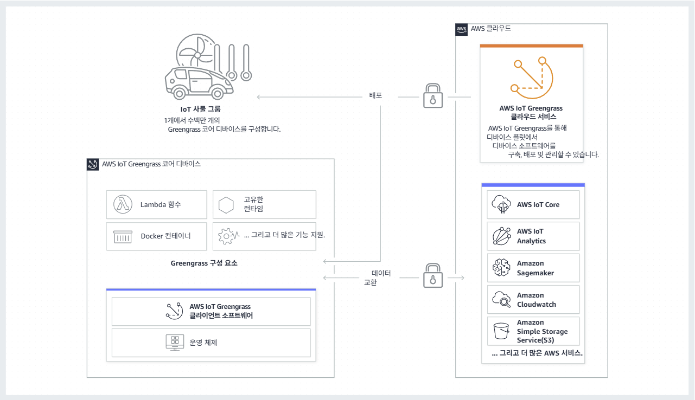

# AWS Greengrass 작동 원리

## 전체 아키텍처



```
Carla Simulator → Greengrass Core Device → AWS IoT Core
                     ↑
                 Components & Deployment
```

## 주요 구성 요소와 역할

### 1. AWS Greengrass

**정의**: AWS 클라우드 서비스를 로컬 디바이스에서 실행할 수 있게 해주는 엣지 컴퓨팅 플랫폼

**프로젝트에서의 역할**:
- Carla 시뮬레이터 안에있는 차량의 데이터를 수집하고 처리
- AWS IoT Core로 안전한 데이터 전송


### 2. 코어 디바이스 (Core Device)

**역할**: Greengrass 소프트웨어가 실행되는 디바이스

**주요 특징**:
- Greengrass Core 소프트웨어 실행
- 로컬 Lambda 함수 실행 환경 제공
- 다른 IoT 디바이스들과의 게이트웨이 역할
- AWS 클라우드와의 보안 연결 관리


### 3. 컴포넌트 (Components)

**역할**: Greengrass에서 실행되는 소프트웨어 모듈

**컴포넌트 유형**:
- **Lambda 컴포넌트**: AWS Lambda 함수를 로컬에서 실행
- **Generic 컴포넌트**: 일반적인 애플리케이션이나 스크립트
- **Machine Learning 컴포넌트**: ML 모델 추론 실행

### 4. 배포 (Deployment)

**역할**: 컴포넌트를 코어 디바이스에 설치하고 구성하는 프로세스

## 데이터 흐름

### 1. 데이터 수집
```
Carla Simulator → 차량/센서 데이터 생성 후 전송
```

### 2. 로컬 처리
```
MQTT 브로커 → 데이터 수집 후 컴포넌트에게 전송
```

### 3. MQTT 발행
```
Data Processor Component → 수집된 데이터를 전처리(필터링 및 변환 등)
                        ↑
                     IPC 통신
                        ↓
MQTT Publisher Component → MQTT 메시지 발행
```

### 4. 클라우드 전송
```
MQTT 브로커 → MQTT 메시지 수신 후 AWS IoT에게 전송
```


### 5. 클라우드 처리
```
AWS IoT Core → 규칙 엔진 → 다른 AWS 서비스 (S3, DynamoDB, Lambda 등)
```

## 장점

### 1. 로컬 처리
```
기존 방식: Carla → 인터넷 → AWS 클라우드
Greengrass: Carla → 로컬 → AWS 클라우드
```
- 빠른 응답 속도
- 인터넷이 없거나 약한 상황에서도 동작 가능

### 2. 확장성
- 여러 시뮬레이션 인스턴스 동시 처리
- 컴포넌트 단위로 기능 확장 가능

### 3. 보안
- AWS IAM 기반 인증/인가
- TLS(Transport Layer Security) 암호화 통신
- 디바이스 인증서 기반 보안

### 참고자료
AWS IoT Greengrass Developer Guide [What is AWS IoT Greengrass?]

https://docs.aws.amazon.com/greengrass/v2/developerguide/what-is-iot-greengrass.html
